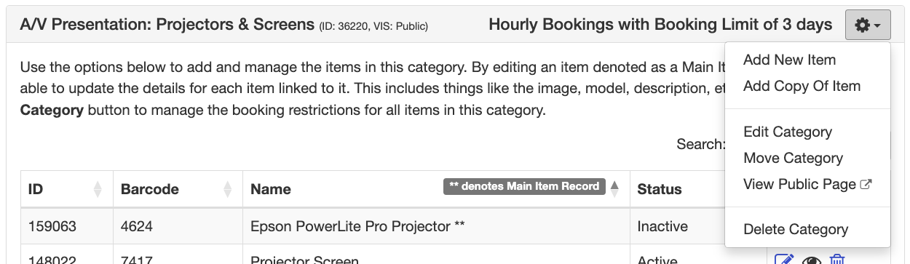
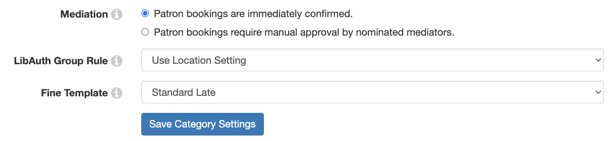
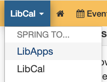
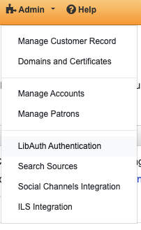
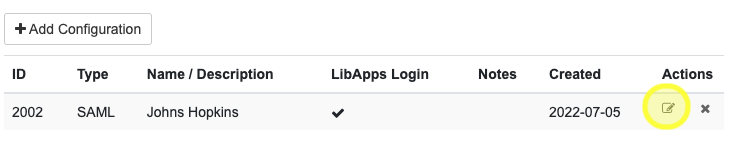
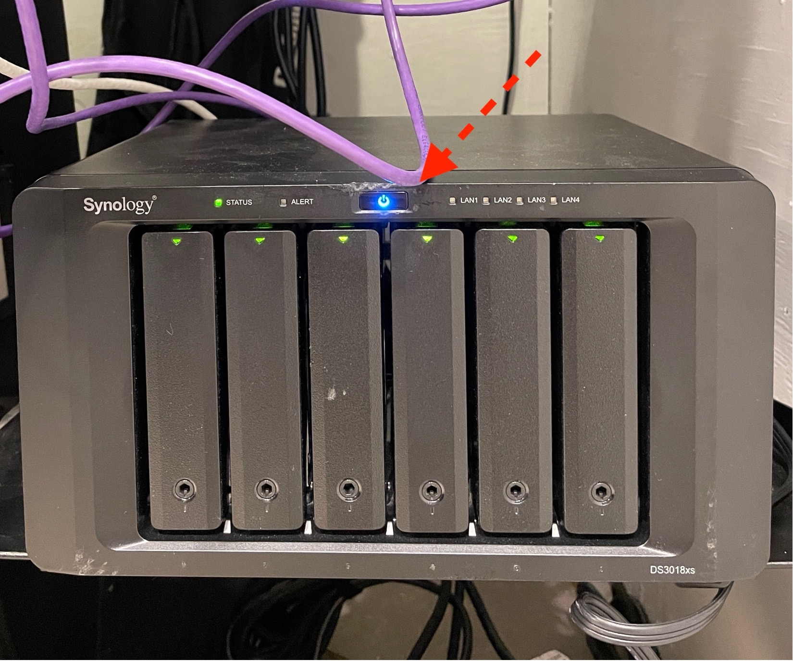

# Systems 

The DMC uses several different software systems for internal projects and patron access.

When working on the Front Desk computer, you should log into all systems as yourself, using your own JHED, and log out when done (the easiest way to do this is to log out of the dmcadmin account.)

---
## BookIt

BookIt, located at [bookit.dmc.jhu.edu](https://bookit.dmc.jhu.edu), is the DMC's equipment and space reservation system. The software is [LibCal](https://www.springshare.com/libcal/) and has been highly customized for the DMC. All patrons and staff use BookIt to track inventory and check it out.

Anyone can view our inventory on BookIt without signing in, but patrons must log into BookIt to create a reservation. BookIt interfaces with the JHU Single Sign On system (the system everyone with a JHED uses to log into myJHU, SIS, etc.) and the Active Directory system.

After new patrons complete registration on HopkinsGroups, DMC staff adds them to the corresponding Active Directory groups using the custom "AD for DMC Equipment Approvers" app (see guide below). Patrons can check their membership status and authorizations using the [Authorization Lookup Tool](https://teams.microsoft.com/l/entity/8dfefe72-3c10-466a-8242-0b79a2d7ac59/_djb2_msteams_prefix_4218721136?context=%7B%22subEntityId%22%3Anull%2C%22channelId%22%3A%2219%3A84be967fe46e44f988912b8e334feaf7%40thread.skype%22%7D&groupId=a60cf059-d221-4e68-982a-585d03682213&tenantId=9fa4f438-b1e6-473b-803f-86f8aedf0dec&allowXTenantAccess=false). See [LibAuth and Group Permissions](Systems.md#libauth-and-group-permissions) below for more information about how JH's Active Directory integrates with BookIt.

Laminated Job guides for common tasks in BookIt are located at the front desk. Digital copies may be accessed here:
- [Adding Members and Authorizations](media/AddingMembersandAuths.pdf)
- [Checking Out Equipment](media/CheckingOutEquipment.pdf)
- [Checking Spaces In/Out](media/CheckingSpacesInandOut.pdf)

### BookIt Item Edit
Each item on BookIt has details we use to keep track of its features, value/serial number, and maintenance history. Pro Staff handles adding new items to the BookIt system, but Stu Staff may need to edit item information directly in the `Item Edit`'s `Details` and `Status` tabs.

You can get to each item's edit screen by going to https://bookit.dmc.jhu.edu/admin/equipment/inventory and clicking the Edit Button  next to its entry.

- Details:
- `Item Instructions`:
  - This field has the itemized list of components in a kit and is used to generate the receipt patrons complete on checkout. Kits with a single item should have this blank.
    - Each component should be on a separate line.
    - Multiples of items should be numbered in the following manner:
  - 
        Battery (1 of 2)
        Battery (2 of 2)
    - Prepend items contained within bags in the kit  `. .` to create indentation.
- 
        Small Lens Bag

      . . Prime Lens (Canon 50mm F1.8 RF STM)

      . . UV Protector

      . . Front Lens Cap

      . . Rear Lens Cap

        Lens Adapter Case

      . . Mount Adapter (Canon EF-EOS R)

      . . Front Lens Cap

      . . Rear Lens Cap`
- Status: 
  - `Active` items are able to be seen and checked out. They might have some problems but are functional and can be used by patrons.
  - `Lost/Broken` items are non-functional.
  - Do not use the `Inactive` status. Pro Staff might use this while getting a new item online.
- Damage Notes:
  - Put information about *current* problems with the kit in this field. Each damage note should describe what's wrong with the kit and be accompanied by a staffer's initials and [Circulation Ticket](#circulation-tickets) number referencing the ticket tracking in Tasks.
  - If a particular item has been fixed or is free of issues, this field should be blank. Update the `Maintenance Log` with 
- Service History Notes:
  - `Last Inventoried:` The date this item last went through the [Inventory](CirculatingResourceManagement#inventory) process.
  - `Replacement Date:` The date this was replaced with a new item that took over its barcode. Most items have this field left blank.
  - `Maintenance Log`: Any maintenance performed on this item, including replacing/repairing components, re-labeling, adding kit pics/quick start guides or other items. Almost all removals of entries in `Damage Notes` should be accompanied by an entry in the `maintenance log.` Each addition should be on a new line within the box and include staffer's initials, dates, and description of what was done.

Here's the HTML code to copy/paste in the Service History Notes for new items. Click the "Source" button in the Text Editor for the field.

````
<p><strong>Last Inventoried:</strong></p>

<table border="1" cellpadding="1" cellspacing="1" style="width: 100px;">
	<tbody>
		<tr>
			<td>&nbsp;</td>
		</tr>
	</tbody>
</table>

<p>&nbsp;</p>

<p><strong>Date Replaced:</strong></p>

<table border="1" cellpadding="1" cellspacing="1" style="width: 100px;">
	<tbody>
		<tr>
			<td>&nbsp;</td>
		</tr>
	</tbody>
</table>

<p>&nbsp;</p>

<p><b>Maintenance Log:</b></p>

<table border="1" cellpadding="1" cellspacing="1" style="width: 500px;">
	<tbody>
		<tr>
			<td>&nbsp;</td>
		</tr>
	</tbody>
</table>
````
### BookIt Backend and Customizations
With the exception of the functional integration of JHU's Active Directory groups to authorize permissions for different equipment/spaces, the extensive customizations to LibCal are mostly cosmetic. They were developed and implemented by former student staffer Mason Gareis. Information on updating and maintaining them is below. But first, let's see how we manage trained user access to equipment...

#### LibAuth and Group Permissions
Active Directory (AD) groups are used to manage bookings for equipment and spaces that require authorization. Users are only able to reserve equipment if their JHED has been added to the corresponding active directory group by a staff member. The permissions can be set per equipment category through the LibCal Dashboard. Navigate to `Admin -> Spaces & Equipment -> Location: DMC Equipment and Lab Spaces -> Equipment & Categories` and then you can click the `Settings` dropdown on each category.



At the bottom of the `General` tab of the `Edit Category` page, you'll see a menu called `LibAuth Group Rule`. By default, it should say "Use Location Setting." The particular authorization level required to reserve a category of equipment or space have a corresponding group rule selected here.



Our Location Setting (configured in `Admin -> Spaces & Equipment -> Edit Location`) is "DMC Members," meaning that only people in the DMC Members group are allowed to reserve equipment. DMC Members have completed our orientation process and have been added to the `"DMC-Members"` AD group.

##### Editing Authorization Groups in LibAuth

"LibAuth" is the configuration that connects the JHU AD with LibCal's group permissions, and it's accessed through the "LibApps" system. Only ProStaff and IT need to access it, and will only need to do so if adding or removing authorization groups from the system.

**Note: An IT administrator must create the AD group FIRST before we can add a new group rule in LibAuth!**

To get to this system, click in the top left corner of the Dashboard:



You may need to authenticate with Hopkins SSO again to access the LibApps dashboard.

Within the `LibApps Home` page, click `Admin -> LibAuth Authentication`.



Here's where our SAML integration with Hopkins SSO has been set up. Click the `Edit Configuration` icon here:



Then click the `Group Permissions` tab at the top of this page. Now you can see all the permission groups that correspond to our special authorizations.

Add a group with the particular name you want to show up in LibCal.

Under `Attribute Name`, put `urn:oid:1.2.840.113556.1.2.102`. All groups will have this same info.

The `Allowed Value(s)` field shows the hierarchy of "objects" in the Active Directory system. This field will look the same in every group except for the very first part. For example, here's the `Allowed Value(s)` for `DSLR: Advanced Group`:

```CN=DMC-Photo-AdvancedDSLR,OU=DMC Equipment,OU=DMC Equipment Borrowing,OU=Groups,OU=USS,DC=win,DC=ad,DC=jhu,DC=edu```

And for the `Audio: Audio Studio`:

```CN=DMC-AudioStudio,OU=DMC Equipment,OU=DMC Equipment Borrowing,OU=Groups,OU=USS,DC=win,DC=ad,DC=jhu,DC=edu```

The bit following `"CN="` at the beginning has to match how it appears in Active Directory exactly (the list of groups in the Active Directory tool). Again, IT must have already first added this group for us before ProStaff can create the connection in LibAuth.


## Discord

The DMC's Discord server is the Virtual Front Desk for patrons asking questions. Its staff-only channels are also frequently used for discussions, announcements, and shift sub requests.

The DMC operates a popular server for patrons on [Discord](bit.ly/discorddmc). When a user joins the server, they must provide their JHU email, which will give them access to the patron-facing channels (assigning them the "patron" role).

Student Staff has an additional Role that opens up staff-only channels, used for announcements, chat about DMC operations, and shift sub requests.

### Discord Rules of Engagement
1. ALL staff should be LOGGED ON to Discord during shifts (both Front Desk and Project shifts if working at a computer). You are not responsible for checking the server or replying to messages when you're not on shift.
2. All staff members must acknowledge every message posted in `#staff-announcements`. Add a "react" icon of your choosing to each message to acknowledge you have read and understood its content. It's recommended that you check this channel at the beginning of each shift and make sure you have read and reacted to every new announcement. Other important messages may be provided in `#staff-chat-dmc-related` or `#on-shift-assignments` (and it's expected that you read them), but you don't need to "react" to them.
3. Staff should respond to questions from patrons using the "reply" function so that context is provided. Most of these questions will be in the `#help` or `#gaming-help` channels. Try to respond in a timely manner.
4. Post a reply to every question on Discord! Often patrons will ask a question on Discord and then get their issue resolved by email or phone. But posting a reply – even a redundant one – signals to other patrons we're responsive and may help answer future questions!
5.  If you need more specific personal information from someone to resolve an issue (such as their JHED), encourage them to DM you on Discord or call the DMC front desk.
   
## Email (Outlook)
All Student Staff has acccess to the dmcstaff@jhu.edu email account and should be monitoring and responding to the inbox during a Front Desk shift.

To access the account:

1. Go to outlook.office.com and log in with YOUR JHED/password.
2. Click the round initials/profile picture button in the top. 
3. Click "Open another mailbox" and type dmcstaff@jhu.edu in the dialogue
4. The dmcstaff@jhu.edu mailbox should open in a new tab.

When signed in you can also access the mailbox by navigating to https://outlook.office.com/mail/dmcstaff@jhu.edu/

*Please use the BROWSER-based system rather than adding it to your desktop Outlook app – this will make sure we can see all the same things (sometimes "sent" emails do not show up to other users if sent from the desktop app)*

You may use the DMC account to respond to patron-initiated questions, or to initiate emails to patrons with questions or reminders about their bookings (e.g. late returns or confirming renewals).

Pro Staff will also forward anything we'd like you to reply to or see on shift. This may include:
- Requests for help from students – like you might answer on Discord #help channel
- Routine requests with easy-to-answer questions from University affiliates/non-patrons about our services.

**Always feel free to copy digitalmedia@jhu.edu on your response if you're unsure or if Pro Staff should follow up.**

#### Email Best Practices:

- Respond with your name + “& The DMC” at the bottom of the email (e.g. “Quack & The DMC”). Only send the email after you've taken action; for example, renewing a booking in BookIt.
- After you respond to an email, please *Archive* it (NOT Delete it).
- If you open but do not act on an email, mark it "unread" in the Inbox.
- If an email is time sensitive and you have questions before you respond to it, reach out to Pro Staff or fellow Student Staff.
- If an email is sitting as "read" in the Inbox but you're unsure if it's been acted upon, check to see if there's a reply in the "Sent" box.
- Use Outlook's ["My Templates"](https://answers.microsoft.com/en-us/outlook_com/forum/all/outlook-web-access-my-templates/b0d7f655-31a1-4c7f-bb22-10373498aca9) feature to quickly access language for common emails (like late item reminders).

#### Using the Outlook calendar:
The shared calendar helps us track all kinds of appointments in the DMC, especially those that reserve lab space or require student staff attention or attendance. This is especially important for special events or those in which the entire lab is reserved (like for a workshop session). 

## Tasks
Tasks is the DMC project management system. Here we organize team projects, submit repair tickets, and purchase requests. It’s built into Teams (though functionality is better in the browser: https://tasks.office.com/).

**All staff should monitor Tasks during their shift for assignments and open tasks that need addressing.**

The DMC uses two "Plans" (Tasks' word for groups of tickets). These plans are further sorted into "Buckets" which categorize them. Finally, each Task may be assigned to individual staff member(s) for feedback or to complete on shift.

### Circulation Tickets
Circulation Tickets track any problems with circulating equipment (e.g missing or broken components) as well as purchase requests and outstanding patron fines.

When a Task is created in this plan, it is automatically re-titled with a sequential number starting with "C" (e.g. "`C0000: Task Title`") for easy reference in BookIt and other systems. Use this number in items' `Damage Notes` field on BookIt. Note: it may take a few minutes for the task title to update!

#### "Fixing" bucket
Tasks in this Bucket document problems with specific equipment. The title should contain the barcode of the item in question and a description of the problem in the "Notes" field. The assigned ticket number (starting with C) should be put in the `Damage Notes` field of the item on BookIt for reference.

#### "Purchasing" bucket
Tasks in the "Purchasing" bucket should be assigned to Travis and should contain: the name of the item needed in the task title, link to the item in question in the notes, and any explanation. If it's for a specific kit, also include this information. Travis updates the task with "In Progress" when the item has been purchased and leaves a comment with the estimated arrival date.

Note: any staff can make a purchase request for anything! DMC Student Staff take the pulse of what gadgets and games they and their peers (our patrons!) are interesteed in. A purchase request does not guarantee acquisition of an item but it's the best way to let Pro Staff know what you think the DMC needs.

#### "Charging Patrons/Financial" bucket
A task in this bucket documents an outstanding charge for a patron. It may be linked to a "Fixing" task or otherwise. Generally this should only be assigned to a Pro Staff but should include reference to a specific patron's JHED and/or BookIt booking in the notes field.

#### Future/Dormant bucket
Pro Staff will move tasks to this bucket if an issue is outstanding but no action needs to be taken in the near future.

### Project Tasks
This plan is used for tracking long-term projects or work for staff to complete during downtime and on Project Shifts. Both Pro Staff and Stu Staff Managers may assign tasks in this bucket to specific people.

### Tasks Best Practices & Reminders
- **Each Task should have a short, descriptive title.** This may be updated if the task changes categories, but should give a clear description to any staff member about the issue. Remember to include item barcodes if necessary!
- **Use checklists if there are sequential steps and/or multiple people working on the task.** The built-in checklist feature is most useful for tasks in Project Tasks plan, but may also be used for multiple issues in a Circulation Ticket.
- **Add comments to track progress.** You can add a comment explaining progress you made during a shift, asking what information you need to continue, or documenting research you completed to help the project along.
- **Only Managers and Pro Staff should assign tasks to other staff.**  Tasks may be reassigned if you're to complete a request during a shift, so pay attention to Teams notifications during shifts to check for new tasks.

### J-Card Kiosk

The J-Card reader lives on the Front Desk and accepts J-Cash payments (the preferred method of payment at the DMC). The J-Card reader has a point-of-sale interface that automatically tallies totals for various DMC printing and consumable products. 

If the J-Card reader enters "continuous check-in mode," do the following:
1. Tap on the screen's corners in this order: top left, bottom right, top right, bottom left.
2. Enter the code `3817`.

If you need to log into the J-Card wedge after a reboot, choose "Jason Charney" as the user and enter code `3817`.

### Credit Card Reader

The DMC has a portable wireless credit card reader that operates on cellular data. We use this device to accept payment from people without J-Cash for a small fee. We can also use it to accept payment at events if needed. 

The credit card reader is a [PAX A920 Pro](https://www.paxtechnology.com/a920pro) that accepts swipe, tap, chip and manual entry. It runs on an AT&T SIM card so there's no need to connect to a WiFi network. The device is battery powered and can be used at tabling events on campus.

Receipt paper for the printer lives in the middle drawer to right of the front desk.

For more information, you can find the device's manual in the top drawer.

***NOTE: If the credit card reader cellular bars register as a solid triangle you need to restart the device. If you run a transaction while the bars are a solid triangle the transaction will be denied.***

**To run a credit card/debit card transaction:**

1. Make sure the device is charged and on. Go to the "Bluefin" app.
2. In the top bar make sure `CREDIT` or `DEBIT` is highlighted appropriately.
3. Press `SALE`
4. Enter in the dollar amount of the service, item or fine. *You can use the J-Card Kiosk to calcuate total cost of consumables with sales tax before entering in the dollar amount in the credit card reader.*
5. Press `CONFIRM`.
6. Have the patron tap, swipe, or insert their chip card into the reader.
7. Have the patron sign the screen if prompted.

**Need to print a receipt?**

***NOTE You must ALWAYS print the receipt for FINES and put it in Pro Staff's office mailbox outside the office door!***

1. Go to the "Bluefin" app.
2. In the top bar, press `FUNC`.
3. Press `Re-Print`.
4. Press `Print Last`. *If you need to print a receipt for the patron and for Pro Staff, you can perform this action twice.*

**Need to void an incorrect charge?**
1. Ask the patron to present the receipt. If it's for the most recent transaction, follow the steps above for printing a receipt.
2. Note on the receipt whether it says "Credit Sale" or "Debit Sale" and the "Transaction #" directly beneath.
3. Go to the Bluefin app.
4. In the top bar make sure `CREDIT` or `DEBIT` is highlighted appropriately based on the information on the receipt.
5. Press `V/SALE`.
6. Enter the "Transaction #" on the receipt.
7. Press `confirm`.
8. To print a receipt for the voided transaction, follow the steps above for printing a receipt.


## RealVNC

RealVNC is the system we use to remote into the gaming computers in the LaB so we don’t have to go upstairs. Typically, this is used to enter an admin password to install/update a game. 

- Patrons do not have admin rights on DMC/Gaming Loft computers and therefore must request the support of DMC staff to install software or games
- DMC Staff are permitted to install software on DMC computers, but must use common sense! (please don't install a Yahoo! toolbar etc.)

If a Patron asks for software to be installed or updated on a Gaming Loft PC and needs an administrator password...
1.	Use your best judgement to determine if the program is malicious or not. If you have any doubts, tell the Patron you are unable to install the software and will ask IT to handle it.
2.	Ask the patron which computer they are using and find it in the RealVNC Viewer client installed on the Front Desk computer. Connect to it.
3.	Enter the password `dmcgaming`. You should now be able to move the mouse around and type on their screen.
4.	Download and install the software on the machine if it is not yet installed.
5.	When prompted for admin credentials in Windows, use **YOUR** normal JHED/password combination as the user.


## HIPPO
HIPPO is our internal server for DMC files and can be accessed when you are connected to the Hopkins network (on campus, or through VPN). It lives in the back of the cage and should remain on at all times. If there is a power outage or if it turns off for some reason, you can turn it back on by pressing the button on the top of the device.



### Connecting to HIPPO
**Mac:**
- Open Finder
- In the Menu Bar Select Go > Connect to Server (or press Cmd+K)
- Type the following path: `smb://HW-DMC-HIPPO/Project`
- Click "Connect"
- Enter your JHED and password

**Windows:**
- Open the File Explorer
- In the address bar, type the following path: `\\hw-dmc-hippo\Project`
- Press the Enter key
- Enter your JHED and password to connect
- *NB: You might need to enter JHED@jh.edu instead of just your JHED for Windows.*

If those file paths don't work for some reason, try the IP address (`10.166.42.124`) instead of "HW-DMC-HIPPO"

### HIPPO Volumes
| Volume (HIPPO/[x]) | Subfolders                               | Permissions                          |
|-------------------|------------------------------------------|--------------------------------------|
| /Project          | Events and Projects<br>PR<br>Circulation | ProStaff; StuStaff                   |
| /Workshop         |                                          | Write: ProStaff<br>Read only: anyone |
| /Admin            |                                          | ProStaff                             |
| /Archive          |                                          | Prostaff                             |
| /StaffHomes       | /Jason<br>/Tony               | Jason<br>Tony              |

### Important Subfolders

#### Circulation
This folder contains templates and media for circulating equipment resources, such as kit pics, quick start guides, item tags, and pictures for BookIt. There are also media project folders for Authorization videos in progress.

#### Events and Projects
All files related to events and projects should live in their own folder on `HIPPO/Project/Events and Projects.`

When a new project is started, add a folder in the current year with the following naming convention:
`[Year]/[date]_[project name]/`

These folders should contain production preparation materials, marketing collateral (including social media posts and anything made in Canva), and documentation from the event.

#### PR & Marketing - TEMPLATES ONLY

This folder contains Templates and assets for DMC-produced material. Make a copy of them to save in their own folders in Events and Projects if you're using anything in here!

### Teams Files

“Teams – DMC Stustaff” is where we store commonly-accessed documents such as shared passwords, consumable purchase tracking spreadsheets, some DMC project files (mostly in Microsoft Office software like Word or Excel), and files referenced in specific Tasks. Note that it's not for media-rich files like Premiere or Photoshop projects!

Anything in Teams is editable and accessible by all DMC Staff, so be careful with your edits.

## HopkinsGroups

HopkinsGroups is an integral part of the DMC's operations. We use HopkinsGroups for:

- Tracking registrations for events and workshops
- Enrolling new members at the DMC
- Tracking one-time fine waivers
- Surveying members about DMC usage
- Contacting DMC members and promoting resources
- Collaborating/co-hosting events with other departments

All DMC staff have some administrative ("officer") access to HopkinsGroups. Here are guides to some tasks you may be asked to complete.

### Creating Events
Pro Staff will create events in HopkinsGroups and may save them as Drafts pending confirmation of event details and completion of marketing collateral.

Event registration should be open from 1 week before the event through the end of the event. For workshops in the lab, 10 registrants is typically the maximum capacity, but this can be scaled down depending on space or complexity. Use the default event template saved in HopkinsGroups but make sure to change the details such as time and registration dates!

Disable the "feedback form" for non-workshop events.

Copy the event link from HopkinsGroups and put it on the [DMC's Linktree](https://linktr.ee/DMCJHU).

At the event itself: [print the QR code for participants to check themselves in.](https://help.campusgroups.com/en/articles/1105584-how-to-activate-the-qr-code-self-check-in-feature-to-your-event)

  
## Social Media and Promotion

### Marketing Collateral
Each public event should be promoted on all DMC channels using marketing collateral created by the DMC. Each piece of marketing created for an event should list:

- Date/Time
- Name of event
- Location (if at DMC, don't need to list a specific location)
- Link to registration on HopkinsGroups  (if applicable) Usually as QR code for all but Instagram.

We create most of our content on Canva. Descriptions for each kind of format are below:
- HopkinsGroups Banner - for displaying as a thumbnail/banner on HopkinsGroups events. It should have the name of the event and graphics, but doesn't need any other information. The finished image should be 760 x 380 pixels. [Here's an already-sized template on Canva.](https://www.canva.com/design/DAFfKZuhWYs/iJcoTbX4WIL-Cl-ff2vu9A/edit?utm_content=DAFfKZuhWYs&utm_campaign=designshare&utm_medium=link2&utm_source=sharebutton)
- Print Flyer - Should be a flyer that includes link for HopkinsGroup registration and the official JHU DMC logo (with the Student Affairs banner), or the "Discover The DMC" graphic. 8.5" x 11"
- TV Signage – Can be adapted from the Print flyer to be 1920 x 1080 pixels. This is what shows on the DMC TV slideshow in the lab.
- Instagram - These can be adapted from the print flyers, but don't need QR codes or descriptive text within the image itself (this should be moved to the caption). If you can, make video content or an animated version to accompany the photo.

### Scheduling posts on Buffer
We use [Buffer](https://buffer.com/) for scheduling posts on [Instagram](https://instagram.com/dmcjhu) and [Facebook](https://www.facebook.com/dmcjhu/). Schedule posts for specific events in the days leading up to it to encourage registration on HopkinsGroups. Other "evergreen" (eg general promotion or non-time-sensitive posts) can be scheduled between time-sensitive ones.

### Posting flyers around campus
The only approved posting locations are any non-departmental bulletin boards inside or outside. Bulletin boards are notated if belonging to a department.
 
Do not post on:
- lightpoles on or off campus
- bricks near breezeway or columns
- on walls that are not bulletin boards
- on doors or windows
- restroom stalls

A full listing of the policy  for both departments and orgs can be found here:
https://studentaffairs.jhu.edu/leed/policies-procedures/event-promotion/
[This guide](media/SA-event-promotion-guide.pdf) for promoting events at JHU is provided by Student Affairs.